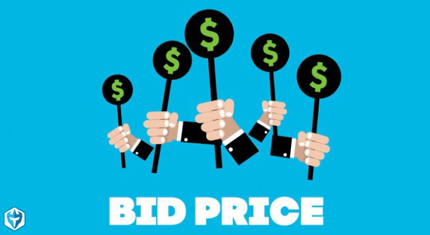

## Ad Biddings and Reserve Price Prediction

Aim 
1) To predict if an advertiser should bid for a marketing slot e.g. a banner on a webpage. The focus is to optimize CTR (click-through-rates) via real-time-bidding (RTB) Classifier Model.

![1]
 (bid1.png)

2) To predict reserve price based on CPM. Reserve pricing algorithm was modelled by keeping CPM as a target variable. Once the reserve price are predicted we know that any advertisers will be willing to go (15-25)% above the reserve price in order to secure a slot.

## Models

We will use 2 models:
1) Classfication to classify Ad bid.
2) Regression to predict Reserve Price.
